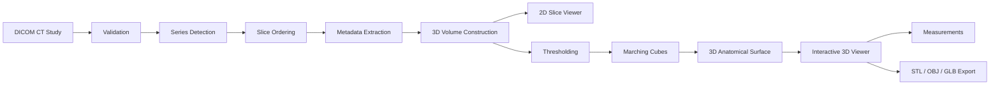
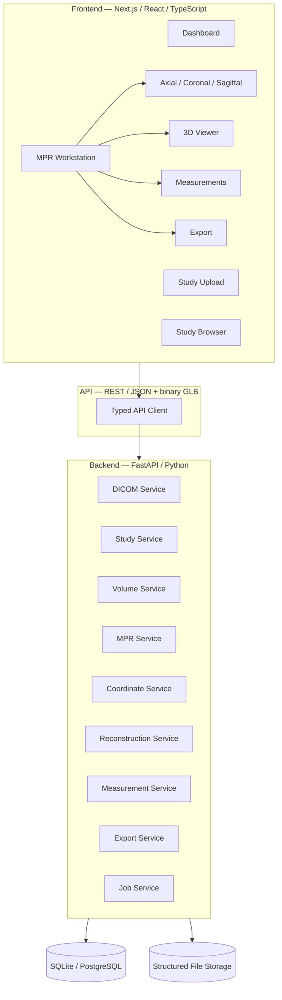

<div align="center">

# OrthoVision AI

### Medical 3D Imaging & Surgical Visualization Platform

*A professional-grade core for transforming de-identified CT DICOM studies into interactive, anatomically accurate 3D models.*

<br/>

[](https://python.org)
[](https://fastapi.tiangolo.com)
[](https://nextjs.org)
[](https://www.typescriptlang.org)
[](https://react.dev)
[](https://threejs.org)
[](LICENSE)

</div>

<br/>

> **⚠️ Medical Disclaimer** — OrthoVision AI is a **medical imaging research and visualization platform**. It is **not a diagnostic device** and must not be used for clinical diagnosis or treatment decisions without appropriate validation, regulatory clearance, and clinical oversight.

---

## Overview

OrthoVision AI is a production-quality **Medical 3D Imaging Core** that converts a real, de-identified CT DICOM study into an interactive 3D anatomical surface model. It establishes the engineering foundation for future AI segmentation, orthopaedic analysis, and surgical planning capabilities.

The complete pipeline is implemented end-to-end — no mocked data, no placeholder functionality:



---

## ✨ Key Features

| Domain | Capability |
| ------ | ---------- |
| **DICOM Ingestion** | Multi-file upload, validation, CT series detection, spatially-correct slice ordering |
| **Volume Construction** | HU conversion (`RescaleSlope`/`Intercept`), preservation of spacing/origin/direction |
| **MPR** | Axial, coronal, and sagittal views from the same volume with synchronized crosshair |
| **2D Viewer** | Canvas-based viewer with scroll, zoom, pan, window/level, and orientation markers |
| **3D Reconstruction** | Thresholding → binary mask → Marching Cubes → spacing-aware anatomical mesh |
| **3D Viewer** | Professional R3F viewer — orbit/zoom/pan, opacity, clipping, MPR planes, orthographic camera |
| **AI Segmentation** | PyTorch + MONAI 3D U-Net pipeline (checkpoint-gated), model registry, CPU/GPU inference |
| **Measurements** | Physical-unit distance (mm) and angle (°) from real model coordinates |
| **Export** | STL, OBJ, and GLB export of the *actual* reconstructed mesh |
| **Jobs** | Background reconstruction with live progress polling |

---

## 🏗️ Architecture

OrthoVision AI follows a clean, modular architecture with strict separation of concerns:



**Design principles:**

- **Medical logic is fully isolated** from web/HTTP concerns — every service operates on plain Python data and is independently unit-testable.
- **3D rendering is decoupled** from DICOM processing via a binary GLB transport layer.
- **Spatial correctness is paramount** — volumes carry spacing, origin, and direction; Marching Cubes output is scaled by voxel spacing to avoid anisotropy distortion.
- **AI-ready boundaries** — the `reconstruction_service` contract is designed so future MONAI/PyTorch segmentation models can emit the same `MeshData` shape without rearchitecting.

---

## 🧰 Tech Stack

| Layer | Technology |
| ----- | ---------- |
| **Frontend** | Next.js 14, React 18, TypeScript, Tailwind CSS, TanStack Query, Three.js, React Three Fiber, Drei |
| **Backend** | Python 3.14, FastAPI, Pydantic v2, Uvicorn, SQLAlchemy 2 |
| Medical Imaging | pydicom, NumPy, SciPy, scikit-image (Marching Cubes) |
| **AI / ML** | PyTorch, MONAI (3D U-Net segmentation; optional, checkpoint-gated) |
| **3D / Mesh** | trimesh (mesh processing + STL/OBJ/GLB export) |
| **Database** | SQLite (development) → PostgreSQL-ready via `DATABASE_URL` |
| **Testing** | pytest (backend), Vitest + Testing Library (frontend) |

> SimpleITK was intentionally replaced with a direct pydicom + NumPy + SciPy + scikit-image pipeline to avoid a Windows DLL-loading incompatibility — with identical medical-image correctness for Phase 1 and full control over the processing.

---

## 🚀 Quick Start

### Prerequisites

- **Python 3.14+** (on Windows, use the `py` launcher)
- **Node.js 20+** and **npm**

### 1. Backend

```bash
cd backend
python -m venv .venv
source .venv/bin/activate        # Windows: .venv\Scripts\activate
pip install -r requirements.txt
cp .env.example .env
uvicorn app.main:app --reload --host 127.0.0.1 --port 8000
```

The interactive API documentation is available at `http://localhost:8000/docs`.

### 2. Frontend

```bash
cd frontend
npm install
cp .env.example .env.local
npm run dev
```

Open `http://localhost:3000`.

---

## 🖼️ Test Data

OrthoVision AI requires **real de-identified CT DICOM data** (not committed to this repository). See [`docs/test-data.md`](docs/test-data.md) for where to obtain legal public datasets.

For an immediate end-to-end test, generate a synthetic-but-valid CT sample:

```bash
cd backend
python generate_sample_dicom.py   # writes backend/sample_dicom/*.dcm
```

Then upload all generated `.dcm` files via the frontend, reconstruct with a **200 HU** threshold, and interact with the result.

### End-to-end verification

```bash
cd backend
python verify_e2e.py              # upload → volume → reconstruct → mesh → export
```

---

## 🧪 Testing

### Backend

```bash
cd backend
pytest
```

Covers DICOM validation, series detection, spatial slice ordering, HU conversion, volume construction, MPR plane extraction, coordinate conversion, reconstruction, mesh generation/validation, export, and API responses.

### Frontend

```bash
cd frontend
npm test            # Vitest
npm run typecheck   # tsc --noEmit
npm run build       # production build
```

---

## 🤖 AI Segmentation Setup (Phase 3)

The AI segmentation pipeline is fully implemented but gated behind two
prerequisites:

1. **Install the AI dependencies** (optional — Phases 1-2 run without them):

```bash
cd backend
py -m pip install -r requirements-ai.txt
```

2. **Install a trained model checkpoint** — place the 3D U-Net weights at:

```text
backend/ai/segmentation/models/bone_1.pt
```

(or set `OV_MODELS_DIR` to a custom models directory).

> **Windows note:** `torch` requires the Microsoft Visual C++ Redistributable.
> If `import torch` fails with a missing `msvcp140.dll`, install it from
> https://aka.ms/vs/17/release/vc_redist.x64.exe.

Until a checkpoint is provided, the system honestly reports **"Model
checkpoint required"** — it never fabricates segmentation results.

---

## 📦 Environment Variables

### Backend (`backend/.env`)

| Variable | Default | Description |
| -------- | ------- | ----------- |
| `STORAGE_DIR` | `./storage` | Root for DICOM/volume/model files |
| `DATABASE_URL` | `sqlite:///./orthovision.db` | SQLAlchemy URL (Postgres for production) |
| `MAX_UPLOAD_SIZE_BYTES` | `2147483648` | Upload size limit |
| `MAX_FILES_PER_UPLOAD` | `5000` | Max files per upload |
| `CORS_ORIGINS` | `http://localhost:3000` | Comma-separated allowed origins |

### Frontend (`frontend/.env.local`)

| Variable | Default | Description |
| -------- | ------- | ----------- |
| `NEXT_PUBLIC_API_URL` | `http://localhost:8000` | Backend base URL |

---

## 🔌 API Overview

Base path: `/api/v1` · Full reference in [`docs/api.md`](docs/api.md)

| Method | Endpoint | Description |
| ------ | -------- | ----------- |
| `POST` | `/studies/upload` | Upload & ingest a DICOM study |
| `GET`  | `/studies` | List studies |
| `GET`  | `/studies/{id}` | Study detail + series |
| `GET`  | `/studies/{id}/metadata` | Extracted metadata |
| `GET`  | `/studies/{id}/slice/{index}` | Windowed axial slice (base64 PNG) |
| `GET`  | `/studies/{id}/volume` | Volume metadata (shape/spacing/origin/direction) |
| `GET`  | `/studies/{id}/mpr/{axial,coronal,sagittal}` | Windowed MPR slice (base64 PNG) |
| `GET`  | `/studies/{id}/coordinates` | World → voxel + HU lookup |
| `GET`  | `/studies/{id}/voxel` | Voxel → world + HU lookup |
| `GET`  | `/segmentation/models` | List segmentation models |
| `POST` | `/segmentation/jobs` | Queue segmentation job |
| `GET`  | `/segmentation/jobs/{id}` | Poll segmentation job |
| `GET`  | `/studies/{id}/segmentations` | List segmentation results |
| `GET`  | `/segmentation/results/{id}` | Get segmentation result |
| `DELETE` | `/segmentation/results/{id}` | Delete segmentation result |
| `POST` | `/studies/{id}/reconstruct` | Queue reconstruction job |
| `GET`  | `/studies/{id}/models` | List models |
| `GET`  | `/models/{id}/mesh` | Binary GLB mesh (3D viewer) |
| `POST` | `/models/{id}/measurements` | Distance / angle measurement |
| `GET`  | `/models/{id}/export/{stl,obj,glb}` | Download actual mesh |
| `GET`  | `/jobs/{id}` | Poll job status/progress |
| `GET`  | `/dashboard` | Dashboard statistics |
| `GET`  | `/health` | Service health |

---

## 📁 Repository Structure

```
.
├── backend/                 # FastAPI application
│   ├── ai/                  # AI segmentation (Phase 3)
│   │   └── segmentation/    # model registry, inference, pre/post-processing
│   ├── app/
│   │   ├── api/             # REST routers
│   │   ├── core/            # config, exceptions, logging
│   │   ├── db/              # SQLAlchemy engine/session
│   │   ├── models/          # ORM models
│   │   ├── schemas/         # Pydantic contracts
│   │   └── services/        # medical pipeline services
│   ├── tests/               # pytest suite + fixtures
│   ├── generate_sample_dicom.py
│   ├── verify_e2e.py
│   ├── requirements.txt     # core (Phases 1-2)
│   └── requirements-ai.txt  # optional AI (Phase 3)
├── frontend/                # Next.js application
│   └── src/
│       ├── app/             # pages (dashboard, upload, study viewer)
│       ├── components/
│       │   ├── medical/     # viewer + domain components (incl. mpr/)
│       │   └── ui/          # design system primitives
│       ├── hooks/           # TanStack Query hooks
│       ├── lib/api/         # typed API client
│       └── types/           # shared TypeScript types
└── docs/                    # design documentation
```

Detailed design docs:

- `docs/architecture.md` — system architecture
- `docs/dicom-pipeline.md` — DICOM ingestion
- `docs/reconstruction.md` — Marching Cubes reconstruction
- `docs/phase-2.md`, `docs/mpr.md`, `docs/coordinate-system.md` — MPR & coordinates
- `docs/viewer.md`, `docs/viewer-architecture.md`, `docs/window-level.md` — viewer
- `docs/phase-3.md`, `docs/ai-segmentation.md` — AI segmentation
- `docs/test-data.md` — obtaining de-identified CT datasets
- `docs/real-medical-data.md` — real DICOM data + Supabase/Firebase wiring
- `docs/api.md` — API reference
- `docs/deployment.md` — production deployment guide
- `docs/phase-1.md` — Phase 1 scope

---

## 🛡️ Medical Data Privacy

- No PHI is intentionally exposed in the UI — patient identifiers are omitted from API responses.
- Uploaded files are isolated per-study and sanitized against path traversal.
- The platform is for research/development only and is **not** a clinically validated diagnostic system.

---

## 🗺️ Roadmap

| Phase | Focus |
| ----- | ----- |
| **1** ✅ | 3D Imaging Core — DICOM ingestion, volume construction, Marching Cubes, interactive viewer |
| **2** ✅ | Advanced visualization — MPR (axial/coronal/sagittal), synchronized crosshair, clipping, opacity, coordinate system |
| **3** ✅ | AI segmentation — MONAI/PyTorch 3D U-Net pipeline, model registry, CPU/GPU inference (checkpoint-gated) |
| **4** | Intelligent analysis — volume, symmetry, ICP registration, deviation maps |
| **5** | Orthopaedic planning — implant visualization & planning |
| **6** | Research platform — projects, annotations, collaboration, reports |
| **7** | AI assistant — natural-language querying of imaging/measurement data |

The service boundaries are intentionally separated so each phase layers onto the existing foundation without rearchitecting.

---

## 📄 License

Licensed under the [MIT License](LICENSE).

---

<p align="center">
  <sub>Built with precision for medical imaging research. Not for clinical diagnosis.</sub>
</p>
