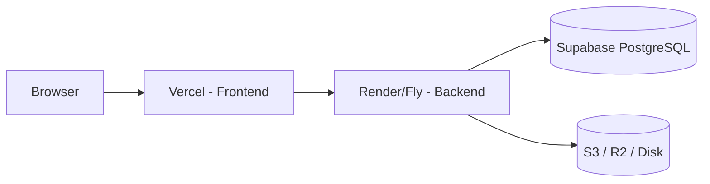

# Deployment Guide

This document describes how to deploy OrthoVision AI to production for a
**research demo / MVP**. It assumes a split architecture:

- **Frontend** → Vercel (Next.js)
- **Backend** → Render or Fly.io (FastAPI)
- **Database** → Supabase (managed PostgreSQL)
- **File storage** → local persistent disk (dev) or S3-compatible object store
  (production)

---

## 1. Architecture Overview



- The frontend talks to the backend via `NEXT_PUBLIC_API_URL`.
- The backend persists metadata to PostgreSQL and binary artifacts (DICOM /
  volume / mesh / mask) to object storage or a persistent disk.
- AI segmentation (`torch` + `monai`) is **optional** and requires separate
  resourcing (see §6).

---

## 2. Prerequisites

- A **Supabase** project (free tier is enough for a demo).
- A **Vercel** account (free).
- A **Render** or **Fly.io** account (free tier works, but see limitations).
- Git repository pushed to GitHub/GitLab.

---

## 3. Database — Supabase (PostgreSQL)

1. Create a project at https://supabase.com.
2. In **Project Settings → Database**, copy the **connection string** (look for
   the "Connection pooling" / "URI" variant — use the **session pooler** for
   serverless backends, or the **direct** connection for a persistent backend).
3. You will set this as `DATABASE_URL` in the backend environment.

> The backend uses SQLAlchemy and `psycopg2-binary`. Tables are created
> automatically on startup via `init_db()`, so no manual migration is required
> for a fresh deploy.

---

## 4. Backend — Render

### Option A: Render Blueprint (recommended)

1. Push this repo to GitHub.
2. In Render, **New → Blueprint** and select your repo.
3. Render uses `render.yaml`. It will:
   - Build the `backend` Docker image.
   - Create a PostgreSQL database and wire `DATABASE_URL`.
4. Set these environment variables (Render Dashboard → your service → Environment):
   - `CORS_ORIGINS=https://your-app.vercel.app`
   - `STORAGE_BACKEND=s3` (or `local` if you attach a disk)
   - S3 vars if using object storage (see §7)
5. Attach a **persistent disk** (paid) if you keep `STORAGE_BACKEND=local`.

### Option B: Manual Web Service

1. New → Web Service → connect repo.
2. **Runtime:** Docker.
3. **Build command:** `docker build -t backend ./backend`.
4. **Start command:** `uvicorn app.main:app --host 0.0.0.0 --port 8000`.
5. Add env vars as above.

---

## 5. Backend — Fly.io (alternative)

```bash
cd backend
fly launch            # detects fly.toml
fly volumes create data -r iad -s 1
fly secrets set DATABASE_URL=postgresql://...
fly secrets set CORS_ORIGINS=https://your-app.vercel.app
fly deploy
```

> Fly.io's free allowance is small; use `auto_stop_machines = "stop"` (already
> set in `fly.toml`) to avoid charges when idle.

---

## 6. AI Segmentation (optional, heavy)

The AI pipeline depends on `torch==2.14.0` + `monai==1.6.0`, which require
~1 GB+ RAM and, ideally, a GPU. This **will not fit on free tiers**.

To enable AI segmentation:

1. Provision a machine with ≥ 2 GB RAM (or a GPU).
2. Install `pip install -r requirements-ai.txt`.
3. Place the model checkpoint at `backend/ai/segmentation/models/bone_1.pt`
   (or set `OV_MODELS_DIR`).
4. Uncomment the `COPY ai ./ai` and `pip install -r requirements-ai.txt` lines
   in the Dockerfile.

Until a checkpoint is provided, the backend honestly reports **"Model
checkpoint required"** — it never fabricates results.

---

## 7. File Storage

### Local (simplest, non-persistent)

- `STORAGE_BACKEND=local`, `STORAGE_DIR=/data/storage`.
- Works only if you attach a persistent disk (Render paid / Fly volume).
- Otherwise files are lost on every redeploy.

### S3-compatible (recommended for stateless deploy)

Use **Cloudflare R2** (free tier) or **Supabase Storage** (S3 API).

```bash
# Install the optional dependency
pip install -r requirements-storage.txt
```

Set these env vars:

```text
STORAGE_BACKEND=s3
S3_BUCKET_NAME=your-bucket
S3_ENDPOINT_URL=https://your-account.r2.cloudflarestorage.com
S3_REGION=auto
S3_ACCESS_KEY=your-access-key
S3_SECRET_KEY=your-secret-key
```

For **Supabase Storage**, the S3 endpoint and keys come from:
**Project Settings → Storage → S3 API**.

---

## 8. Frontend — Vercel

1. Push the repo to GitHub.
2. In Vercel, **New Project → import repo**.
3. Set root directory to `frontend`.
4. Set `NEXT_PUBLIC_API_URL` to your deployed backend URL
   (e.g. `https://orthovision-backend.onrender.com`).
5. Deploy.

`frontend/vercel.json` is provided; update its `NEXT_PUBLIC_API_URL` placeholder
before deploying (or override it in the Vercel dashboard).

---

## 8b. Background jobs — Redis + Worker

For production (so long reconstruction/segmentation jobs survive restarts and
scale independently), use the Redis queue backend.

1. Provision a Redis instance (Render Redis, Railway Redis, Upstash, or
   self-hosted).
2. Set `JOB_BACKEND=redis` and `REDIS_URL=...` on the **web service**.
3. Deploy the **worker** (separate process/image — `Dockerfile.worker`):
   - Render Blueprint already defines a `worker` service (see `render.yaml`).
   - Locally: `JOB_BACKEND=redis REDIS_URL=... python worker.py`.

With `JOB_BACKEND=local`, jobs run in-process threads (dev only) and no
separate worker or Redis is needed.

---

## 9. Environment Variables Reference

### Backend

| Variable | Example | Purpose |
| -------- | ------- | ------- |
| `DATABASE_URL` | `postgresql://...` | PostgreSQL connection |
| `CORS_ORIGINS` | `https://app.vercel.app` | Allowed frontend origins |
| `STORAGE_BACKEND` | `local` \| `s3` | Storage engine |
| `STORAGE_DIR` | `/data/storage` | Local storage root |
| `S3_BUCKET_NAME` | `my-bucket` | Object storage bucket |
| `S3_ENDPOINT_URL` | `https://...r2.cloudflarestorage.com` | S3 endpoint |
| `S3_REGION` | `auto` | S3 region |
| `S3_ACCESS_KEY` / `S3_SECRET_KEY` | — | S3 credentials |
| `JOB_BACKEND` | `local` \| `redis` | Job queue engine |
| `REDIS_URL` | `redis://...` | Redis connection (when redis backend) |
| `REDIS_QUEUE` | `orthovision` | Redis queue name |
| `OV_MODELS_DIR` | `/app/ai/segmentation/models` | AI model checkpoint dir (optional) |

### Frontend

| Variable | Example | Purpose |
| -------- | ------- | ------- |
| `NEXT_PUBLIC_API_URL` | `https://backend.onrender.com` | Backend base URL |

---

## 10. Limitations on Free Tiers

| Concern | Effect |
| ------- | ------ |
| **Render free** (512 MB RAM) | No AI; large CT studies may OOM; cold start after idle. |
| **Ephemeral disk** | Local files vanish on redeploy → use S3. |
| **Background threads** | In-process job executor may be killed on idle/restart. |
| **AI (torch/monai)** | Needs ≥ 2 GB RAM + ideally GPU → not on free tiers. |

For a production **SaaS**, you would additionally need: persistent disk/object
storage (mandatory), a real job queue (Redis + Celery/Arq), GPU inference,
authentication, and HIPAA compliance (this is a medical platform).
